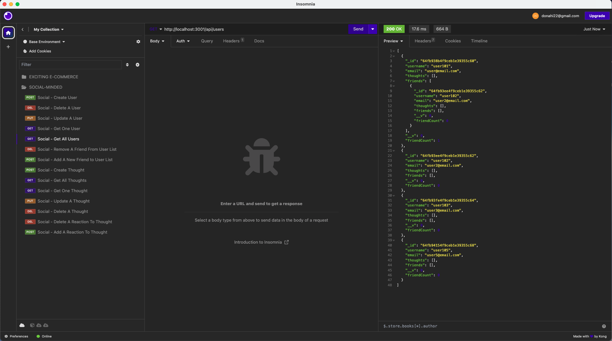

## Social-Minded

### Table of Contents
1. [Description](#description)
2. [Installation](#installation)
3. [Technologies](#technologies) 
4. [Usage](#usage)
5. [Contributing](#contributing)
6. [Collaborators](#collaborators)
7. [Questions](#questions)
8. [License](#license)

### Description
The Social Minded app is a social media application that allows users to create an account, post thoughts, and react to other users' thoughts. Users can also add friends to their friend list and remove friends from their friend list. The Social Minded app uses Express.js for routing, a MongoDB database, and the Mongoose ODM.

### Installation
To install the Social Minded app, follow these steps:
 1. Clone the GitHub repository: `git@github.com:Augustus1110/Social-Minded.git`
 2. Navigate to the project's directory: `cd Social-Minded`
 3. Install the necessary NPM packages: `npm install`

### Technologies
This project was built using:
    - Node.js
    - Express.js
    - MongoDB
    - Mongoose ODM
    - JavaScript

### Usage
To use the Social Minded app, follow these steps:
    1. Navigate to the project's directory: `cd Social-Minded`
    2. Run the application: `npm start`
    3. Open Insomnia Core or Postman and test the application's API routes.

### Images

### Contributing
This project is not accepting contributions at this time.

### Collaborators
This project was completed with guidance and assistance from EdX/UC Berkeley Extension tutor Robby Kurle. The date formatting function in dateFormat.js was sourced from EdX/UC Berkeley Extension course materials.

### Questions
If you have any questions, please contact me:

- GitHub: [Augustus1110](https://github.com/Augustus1110)
- Email: donahi22@gmail.com

### License
MIT
(https://opensource.org/licenses/MIT)

### Video Walkthrough
(https://drive.google.com/file/d/1j1CMv-B35NBILn0j3B_4hUtdxQT7-aB-/view)
